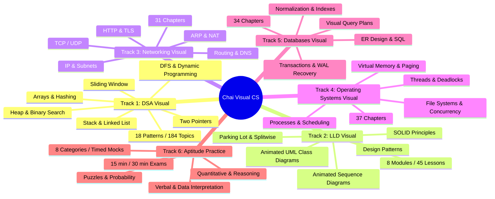

# US-G034: Chai Visual — Learn CS by Watching It Move (G058)

**Epic:** Epic 34 — Chai Visual Curriculum Catalog & Foundational Interactive Engine (G058)  
**Source URL:** [https://dsa.chaicode.com/](https://dsa.chaicode.com/)  
**Target Directory:** `public/games/chai-visual/`  
**Created:** 2026-09-17  
**Estimate:** L (4 Focused Stories)  

> [!IMPORTANT]
> **ข้อจำกัดเรื่องการเข้าถึงเนื้อหา (Auth & Membership Gate):**  
> เว็บไซต์ `dsa.chaicode.com` เป็นแพลตฟอร์มการศึกษาที่ต้องสมัครสมาชิก (Login / Paid Subscription) จึงจะสามารถเข้าถึงเนื้อหาเชิงลึกทั้งหมดได้  
> **แนวทางในเฟสนี้:** รวบรวม **"รายการหัวข้อเนื้อหาทั้งหมด (Curriculum Catalog)"** ที่เปิดเผยบนสารบัญสาธารณะ และสกัดเฉพาะ **"โครงสร้างไอเดียการนำเสนอพื้นฐาน (Foundational Presentation Architecture)"** ที่แสดงในตัวอย่างหน้าแรก (เช่น Two Pointers / Valid Palindrome / Two Sum Approach Leap) เพื่อนำมาสร้างเป็น Showcase Prototype บน GameDevJS Hub

---

## 📚 1. สารบัญหัวข้อเนื้อหาทั้งหมดจากเว็บไซต์ (Complete Topic Catalog)

จากการสำรวจโครงสร้างหน้าเว็บสาธารณะ แพลตฟอร์มแบ่งเนื้อหาออกเป็น **6 สายการเรียนรู้หลัก (Tracks)** และ 1 ระบบวางแผนเตรียมสัมภาษณ์ (Roadmap):



### 1.1 Track 1: DSA Visual (Data Structures & Algorithms)
* **สถิติเนื้อหา:** 18 Patterns · 184 Topics
* **หน้าสาธารณะ:** `/two-pointers/intro`, `/two-pointers/valid-palindrome`
* **รูปแบบการนำเสนอ:** สอนแบบก้าวต่อก้าว (Step-by-Step) เริ่มจากแนวคิด Brute Force ก่อน แล้วจึงต่อยอดสู่วิธี Optimized Trick พร้อมอธิบายเหตุผล (The Why)
* **หัวข้อย่อยและรูปแบบอัลกอริทึม:**
  1. Two Pointers (Valid Palindrome, Two Sum, 3Sum, Container With Most Water)
  2. Arrays & Hashing (Prefix Sum, Frequency Counting)
  3. Sliding Window (Longest Substring Without Repeating Characters)
  4. Stack (Valid Parentheses, Monotonic Stack)
  5. Linked List (Fast & Slow Pointers, Reversal)
  6. Heap / Priority Queue (Top K Elements, Merge K Lists)
  7. Binary Search (Search in Rotated Array, Range Queries)
  8. Depth-First Search (DFS) & Breadth-First Search (BFS)
  9. Dynamic Programming (Memoization, Tabulation)
  10. (+ อีก 9 Patterns รวมเป็น 18 Patterns ครบวงจร)

### 1.2 Track 2: LLD Visual (Low-Level & OOP Design)
* **สถิติเนื้อหา:** 8 Modules · 45 Lessons
* **หน้าสาธารณะ:** `/lld/lld-intro/overview`, `/lld`
* **รูปแบบการนำเสนอ:** สอน Object-Oriented Design ด้วย **Animated UML** โดยที่ Class Diagrams และ Sequence Diagrams ค่อย ๆ วาดและส่งข้อความไปมาระหว่าง Object อัตโนมัติ
* **หัวข้อย่อย:**
  1. SOLID Principles (Single Responsibility, Open-Closed, Liskov, Interface Segregation, Dependency Inversion)
  2. Design Patterns (Factory, Singleton, Observer, Strategy, Decorator ฯลฯ)
  3. Animated UML Class Diagrams & Relationships (Inheritance, Composition, Aggregation)
  4. Animated Sequence Diagrams (Lifelines, Messages, Synchronous/Asynchronous Flows)
  5. Real-World Case Studies: ระบบจอดรถ (Parking Lot System), ระบบแชร์ค่าใช้จ่าย (Splitwise)

### 1.3 Track 3: Networking Visual (Computer Networks, From the Wire Up)
* **สถิติเนื้อหา:** 31 Chapters · Illustrated Visual Notes
* **หน้าสาธารณะ:** `/computer-network`
* **รูปแบบการนำเสนอ:** ภาพจำลองตั้งแต่การเรียกฟังก์ชัน `fetch()` เดียว ส่งผ่านข้อมูลเป็น Bits บนสายเคเบิล/คลื่นวิทยุ แล้วเดินทางขึ้นมาผ่าน Layer ต่าง ๆ
* **หัวข้อย่อย:**
  1. IP Addressing & Subnet Masking
  2. TCP Connection (3-Way Handshake, Flow Control) & UDP Datagrams
  3. Network Routing Algorithms & Gateway
  4. Domain Name System (DNS Resolution Flow)
  5. HTTP/1.1, HTTP/2, HTTP/3 และการเข้ารหัส TLS / SSL Handshake
  6. Address Resolution Protocol (ARP)
  7. Network Address Translation (NAT & Port Forwarding)

### 1.4 Track 4: Operating Systems Visual (How Your Machine Runs Code)
* **สถิติเนื้อหา:** 37 Chapters · Illustrated Visual Notes
* **หน้าสาธารณะ:** `/operating-system`
* **รูปแบบการนำเสนอ:** จำลองการทำงานตั้งแต่ระดับ System Call ลงไปถึง Kernel Context Switching
* **หัวข้อย่อย:**
  1. Process Lifecycle & PCB (Process Control Block)
  2. CPU Scheduling Algorithms (FCFS, SJF, Round Robin, Multi-level Queue)
  3. Threads & Multithreading Models
  4. Deadlocks (Conditions, Prevention, Banker's Algorithm)
  5. Virtual Memory (Paging, Page Tables, Page Faults, TLB)
  6. File Systems (Inodes, Directory Structures)
  7. Concurrency & Synchronization (Semaphores, Mutex, Race Conditions)

### 1.5 Track 5: Databases Visual (What Your Query Actually Does)
* **สถิติเนื้อหา:** 34 Chapters · Illustrated Visual Notes
* **หน้าสาธารณะ:** `/dbms`
* **รูปแบบการนำเสนอ:** ติดตามคำสั่ง Query จาก ER Diagram บนกระดาษ ลงไปถึงโครงสร้าง B+ Tree, การเลือกแผนประมวลผล (Query Plan), และการเขียน Log ก่อน Commit
* **หัวข้อย่อย:**
  1. ER Diagram Design & Relational Mapping
  2. SQL Execution Flow
  3. Database Normalization (1NF, 2NF, 3NF, BCNF)
  4. B-Tree & B+ Tree Indexes Traversal
  5. Visual Query Execution Plans & Cost Estimation
  6. Transactions & ACID Properties
  7. Database Recovery (Write-Ahead Logging / WAL, Checkpoints)

### 1.6 Track 6: Aptitude Practice (Timed Placement Mocks)
* **สถิติเนื้อหา:** 8 หมวดหมู่ข้อสอบพร้อมเฉลยและวิธีคิดละเอียด
* **หน้าสาธารณะ:** `/aptitude`
* **หมวดหมู่:** Quantitative, Reasoning, Verbal, Data Interpretation, Puzzles, Probability
* **โหมดจับเวลา:** สอบด่วน 15 นาที (20 ข้อ) และ สอบเต็มรอบ 30 นาที (40 ข้อ)

---

## 🎨 2. โครงสร้างไอเดียการนำเสนอพื้นฐาน (Foundational Presentation Architecture)

เอกลักษณ์ในการนำเสนอของ Chai Visual ที่เราจะนำมาเป็นต้นแบบประกอบด้วย 4 เสาหลัก:

```text
┌────────────────────────────────────────────────────────────────────────┐
│  Chai Visual — Presentation Engine Architecture                        │
├────────────────────────────────────────────────────────────────────────┤
│  1. Aesthetic & Typography: Paper background (#111a17 / #efeeeb)        │
│     Font Hand + Font Sketch + Border ลายมือวาด (sketch-border)          │
├────────────────────────────────────────────────────────────────────────┤
│  2. Interactive Step-by-Step Playhead:                                 │
│     [⏮ Step Back]  [▶ Play / ⏸ Pause]  [⏭ Step Forward]  [Speed: 1x]   │
├────────────────────────────────────────────────────────────────────────┤
│  3. Multi-Approach Comparison (Approach Leap):                          │
│     (o) Brute Force O(n²)  ( ) Sort + 2 Pointers  ( ) Hash Map O(n)   │
│     Time & Space Dynamic Gauge + Work to solve Operations Meter        │
├────────────────────────────────────────────────────────────────────────┤
│  4. Dynamic Pointer & State Explanation:                               │
│     - Pointer L (Orange #ff8b3d) / Pointer R (Blue #7fa9dd)            │
│     - Array Boxes with Highlight & Comparison Explanation Banner       │
└────────────────────────────────────────────────────────────────────────┘
```

1. **Aesthetic ลายเส้นกระดาษสเก็ตช์ (Paper & Ink Theme):**
   - โทนสีกระดาษ `bg-paper` และตัวอักษรหมึก `text-ink`
   - ขอบลายเส้นมือวาดแบบ CSS `sketch-border` และ `sketch-border-soft`
   - ตัวอักษรลายมือ (Handwritten/Sketch Fonts) เช่น Patrick Hand, Caveat หรือ Geist Mono
2. **ตัวควบคุมแอนิเมชันทีละก้าว (Step-by-Step Playhead Controls):**
   - ปุ่มควบคุม: เล่นอัตโนมัติ (Play), หยุดชั่วคราว (Pause), ถอยหลัง 1 ก้าว (Step Back), ก้าวไปข้างหน้า (Step Next), และรีเซ็ต (Reset)
   - ปรับความเร็วได้ (0.5x, 1x, 2x)
3. **ระบบสลับเปรียบเทียบแนวทางแก้ปัญหา (Approach Leap):**
   - แสดงตัวเลือกเช่น `Brute Force` vs `Sort + Two Pointers` vs `Hash Map`
   - สลับแท็บแล้วการแสดงผล Big-O (Time / Space Complexity) และหลอดแสดงจำนวนรอบคำนวณ (Work to solve operations) จะขยับเปลี่ยนทันที
4. **ตัวชี้และป้ายคำอธิบายสถานะ (Interactive Pointers & Explanation Banner):**
   - หมุดตัวชี้สีสดใส: Pointer L (สีส้ม `#ff8b3d`) และ Pointer R (สีฟ้า `#7fa9dd`)
   - กล่องข้อความด้านล่างอธิบายตรรกะแบบเรียลไทม์ เช่น `"1 + 15 = 16 > 14 — move right in"`

---

## 🎯 3. User Story Breakdown (สำหรับเฟสเก็บข้อมูลและสร้าง Prototype)

### [US-G034-00] Complete Curriculum Catalog & Topic Breakdown Specification
- **Statement:** ในฐานะ Educational Content Architect ฉันต้องการจัดทำเอกสารสารบัญโครงสร้างเนื้อหาทั้ง 6 Tracks ให้ครบถ้วนสมบูรณ์ใน `docs/gdd/games/chai-visual/spec.md` พร้อมระบุรายการหัวข้อที่ติดระบบสมาชิก (Paywall) และหัวข้อที่เปิดเป็นสาธารณะ
- **Acceptance Criteria:**
  - [ ] จัดทำเอกสาร GDD / Curriculum Directory ใน `docs/gdd/games/chai-visual/spec.md`
  - [ ] บันทึกรายชื่อ 18 DSA Patterns, 8 LLD Modules, 31 Network Chapters, 37 OS Chapters, 34 DBMS Chapters
  - [ ] กำหนดสถานะ Public Preview สำหรับโจทย์ Two Pointers และระบุหัวข้ออื่นเป็น Catalog Index
  - [ ] สรุปคุณค่าของแต่ละ Track สำหรับเป็นคู่มืออ้างอิงของทีม

### [US-G034-01] Paper/Ink Theme, Sketch CSS System & Public Asset Extraction
- **Statement:** ในฐานะ UI/UX Frontend Developer ฉันต้องการสกัดโทนสี Paper & Ink, สไตล์ชีทกรอบลายเส้น `sketch-border`, ฟอนต์ลายมือ, และไอคอนสาธารณะของ Chai Visual มาสร้างเป็น Design System ขนาดย่อมใน `public/games/chai-visual/`
- **Acceptance Criteria:**
  - [ ] สกัด CSS Custom Properties สำหรับ `--bg-paper`, `--text-ink`, `--accent` และคลาส `.sketch-border`
  - [ ] ติดตั้งฟอนต์ลายมือที่เข้ากันได้ (เช่น Patrick Hand หรือ Caveat)
  - [ ] ดึงรูปภาพมาสคอต `/chai-mascot-dark.png` และ SVG Icons พื้นฐาน
  - [ ] รองรับการสลับ Dark / Light Paper Mode ได้อย่างถูกต้อง

### [US-G034-02] Foundational Interactive Player Prototype (Two Pointers & Two Sum Showcase)
- **Statement:** ในฐานะ Algorithm & Animation Programmer ฉันต้องการสร้างคอมโพเนนต์จำลองแอนิเมชันอัลกอริทึมพื้นฐานที่เล่นได้จริง (Standalone Step-by-step Runner) โดยจำลองโจทย์ Two Pointers (Target Sum) และ Valid Palindrome
- **Acceptance Criteria:**
  - [ ] มีปุ่มควบคุม Step Back, Play/Pause, Step Next และแถบปรับความเร็ว
  - [ ] หมุดชี้ L (ส้ม) และ R (ฟ้า) ขยับเลื่อนตำแหน่งตามอาร์เรย์ได้อย่างนุ่มนวล
  - [ ] กล่องอธิบายผลลัพธ์ (Step Explanation) อัปเดตข้อความตามเงื่อนไขการคำนวณจริง
  - [ ] แท็บ Approach Leap: สลับดู Brute Force (O(n²)) และ Two Pointers (O(n)) พร้อมมิเตอร์นับจำนวนรอบ Operations

### [US-G034-03] Curriculum Directory Viewer & GameDevJS Hub Integration
- **Statement:** ในฐานะ Frontend Developer ฉันต้องการสร้างหน้า UI สารบัญหลัก (Curriculum Navigator) ที่ผู้ใช้สามารถเลือกดูหัวข้อทั้ง 6 Tracks และเปิดเล่น Interactive Showcase ได้ทันที พร้อมเชื่อมโยงเข้าสู่ Next.js Portfolio Card
- **Acceptance Criteria:**
  - [ ] หน้า Navigation แสดงการ์ด 6 Tracks พร้อมตัวเลขจำนวนหัวข้อ และสถานะ `Interactive Demo` / `Curriculum Preview`
  - [ ] แสดงป้ายแจ้งเตือน (Disclaimer) อย่างชัดเจนว่าเนื้อหาฉบับเต็มบางส่วนต้องลงทะเบียนกับทาง ChaiCode
  - [ ] เพิ่มการ์ดเกมลงใน `src/app/page.js` ในหมวดหมู่ "การศึกษา / ปริศนาโค้ด"
  - [ ] ตรวจสอบการเปิดเล่นผ่าน Iframe Modal ให้เรนเดอร์ลื่นไหลและพอดีกับหน้าจอทุกขนาด

---

## 🛠 4. Action Items สำหรับทีม
1. บันทึกสารบัญหัวข้อทั้งหมดลงในเอกสาร GDD Spec
2. สร้างหน้าเว็บ Static Standalone ใน `public/games/chai-visual/index.html` ที่รันได้ 100% แบบไม่ต้องต่ออินเทอร์เน็ต
3. ออกแบบเฉพาะ Interactive Two-Pointers Demo เป็นแกนหลักของการนำเสนอไอเดีย
4. ทำ UI แสดงผังหลักสูตร (Curriculum Tree) ให้ผู้เข้าชมคลิกดูภาพรวมของเนื้อหาทั้งหมดได้
